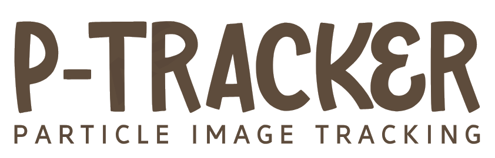

<p align="center">

</p>

## What is `p-tracker`?  

`p-tracker` is a framework for Digital Image Correlations (DIC) written in C++. The project was initiated by <vincent.richefeu@univ-grenoble-alpes.fr> and <gael.combe@grenoble-inp.fr> under the name of `tracker` (without the `p-` before). The special feature of the code is that it can follow the 2D positions of the particles on the photographs **without losing the thread with any of them**. This is not possible with a conventional correlation tool, no matter well-performing it may be.  This focus on the discrete nature of tracking explains why the method is referred to as **Particle Image Tracking (PIT)** rather than DIC. However, the tool is still capable of performing DIC.

In its history, `p-tracker` is closely linked to a laboratory device called 1γ2ε, which consists of Schneebeli rolls assembled in a frame allowing solicitations in stress and/or strain as complex as desired. 


### Source tree 

* `sphinxdoc`: user documentation (sphinx with ReStructuredText)
* `examples`: examples for usage tutorials or for testing features
* `src`: C++ source files

## Credits


## Features


## How to install

The source code can be cloned from github repository:

```sh
git clone https://github.com/richefeu/p-tracker.git
```

For reading digital images, two libraries are required: `libtiff` and `libraw`. On an apple OS, you can install them via homebrew:

```sh
brew update
brew install libtiff
brew install libraw
```

On an unix OS, use the package managelent tool to install them. For example, on ubuntu, you can make:

```sh
sudo apt-get update -y
sudo apt-get install -y libtiff4-dev
sudo apt-get install -y libraw-dev
```

Then, the compilation should be as simple as typing `make` from the `src` folder:

```sh
cd src
make
```

## How to perform a particle image tracking

## File format


| Column | Description                                                                                                                 |
|--------|-----------------------------------------------------------------------------------------------------------------------------|
| 1      | Reference x-position, in pixel (integer number)                                                                             |
| 2      | Reference y-position, in pixel (integer number)                                                                             |
| 3      | Reference rotation with respect to horizontal, in radian (decimal number, generally 0)                                      |
| 4      | Radius in pixel (decimal number, not-usefull for non circular particles)                                                    |
| 5      | Cumulated displacement, with respect to the reference x-position, in pixel (decimal number)                                 |
| 6      | Cumulated displacement, with respect to the reference y-position, in pixel (decimal number)                                 |
| 7      | Cumulated rotation, with respect to the reference rotation (generally horizontal), in radian (decimal number)               |
| 8      | Last displacement increment, with respect to the previous cumulated x-position, in pixel (decimal number)                   |
| 9      | Last displacement increment, with respect to the previous cumulated y-position, in pixel (decimal number)                   |
| 10     | Last rotation increment, with respect to the previous cumulated rotation (generally horizontal), in radian (decimal number) |
| 11     |    NCC         |
| 12     |    NCC_rescue         |
| 13     |    NCC_subpix         |


